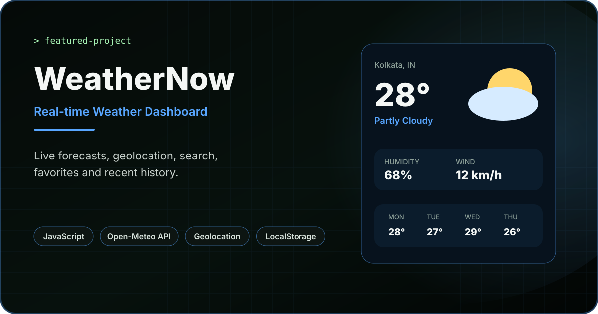

<div align="center">



<br/>

# WeatherNow

### Real-time Weather Dashboard with Modern JavaScript

A responsive weather application that combines live Open-Meteo data, city autocomplete, browser geolocation, hourly and weekly forecasts, favorites, recent searches and persistent user preferences.

[](https://weathernow-weather-dashboard.vercel.app/)
[](https://developer.mozilla.org/en-US/docs/Web/JavaScript)
[](https://open-meteo.com/)

</div>

---

## Overview

**WeatherNow** is a frontend weather dashboard built with HTML, CSS and modular JavaScript ES6+.

The project focuses on practical browser-side application development: fetching and normalizing external API data, coordinating application state, rendering dynamic UI, handling asynchronous errors, persisting preferences with LocalStorage and integrating browser APIs such as Geolocation.

Unlike a static weather mockup, WeatherNow loads real forecast data and updates the interface based on the location, selected temperature unit and user preferences.

---

## Live Application

**Production:** https://weathernow-weather-dashboard.vercel.app/

> No API key is required for the current Open-Meteo integration.

---

## Core Features

### Live Weather Search

- Search weather by city name
- Open-Meteo Geocoding API integration
- Normalized location data
- Clear loading and error states
- Default weather loaded for Kolkata on startup

### Smart Autocomplete

- City suggestions while typing
- Minimum search-length validation
- Debounced API requests
- Protection against stale autocomplete responses
- Keyboard navigation with Arrow Up / Arrow Down
- Enter to select a suggestion
- Escape to close suggestions
- Click-outside handling

### Current Location

- Browser Geolocation API support
- High-accuracy location requests
- Location timeout handling
- Dedicated permission-denied messaging
- Position-unavailable and timeout error states
- Weather loading directly from latitude and longitude

### Current Conditions

WeatherNow displays:

- Current temperature
- Weather condition
- Feels-like temperature
- Relative humidity
- Wind speed
- Visibility
- Surface pressure

### Forecasts

- Next 8 hourly forecast entries
- Hourly temperature
- Precipitation probability
- Weather condition indicators
- Seven-day forecast
- Daily minimum and maximum temperatures

### Favorite Cities

- Save frequently checked cities
- Remove individual favorites
- Clear all favorites
- Open a saved city with one click
- Up to 8 favorite locations stored locally

### Recent Searches

- Stores recently searched cities
- Removes duplicate city entries
- Keeps the most recent 6 searches
- One-click weather reload
- Clear recent-search history

### Temperature Preferences

- Celsius / Fahrenheit switching
- Selected unit persisted in LocalStorage
- Current weather automatically reloads when the unit changes
- Accessible `aria-pressed` state on unit controls

### Theme Experience

- Light and dark themes
- System theme detection
- Saved theme preference
- Automatic system-theme updates when no manual preference is stored

---

## API Integration

WeatherNow uses two Open-Meteo services.

### Geocoding API

Used to search cities and retrieve normalized location information including:

```text
name
country
state
latitude
longitude
timezone
```

### Forecast API

Requests current, hourly and daily data including:

```text
Current
├── temperature
├── humidity
├── apparent temperature
├── weather code
├── surface pressure
├── wind speed
└── visibility

Hourly
├── temperature
├── precipitation probability
├── weather code
└── day/night state

Daily
├── weather code
├── maximum temperature
└── minimum temperature
```

The forecast request uses automatic timezone detection and a seven-day forecast window.

---

## Application Architecture

The JavaScript is separated by responsibility rather than keeping the full application in one file.

```text
weathernow-weather-dashboard/
│
├── assets/
│   └── favicon.svg
│
├── css/
│   └── style.css
│
├── docs/
│   └── weathernow-cover.svg
│
├── js/
│   ├── api.js
│   ├── app.js
│   ├── ui.js
│   └── utils.js
│
├── index.html
└── README.md
```

### `api.js`

Handles external API communication, query construction, response validation, location normalization and weather requests.

### `app.js`

Acts as the main application controller. It manages state, LocalStorage, search behavior, autocomplete, favorites, recent searches, temperature units, themes, geolocation and event listeners.

### `ui.js`

Responsible for DOM rendering and UI states such as current weather, hourly forecasts, weekly forecasts, favorites, recent searches, autocomplete, loading and errors.

### `utils.js`

Contains reusable weather-code mapping, formatting and value-conversion helpers.

---

## Browser Storage

WeatherNow persists user preferences using separate LocalStorage keys for:

```text
Theme preference
Temperature unit
Recent searches
Favorite cities
```

This keeps the experience consistent after a page refresh without requiring user accounts or a backend database.

---

## User Flow

```text
Open WeatherNow
      ↓
Default city loads
      ↓
Search city / choose suggestion / use location
      ↓
Fetch location + weather data
      ↓
Render current conditions
      ↓
Render next 8 hours
      ↓
Render 7-day forecast
      ↓
Save city / switch unit / change theme
      ↓
Preferences persist in LocalStorage
```

---

## Tech Stack

| Area | Technology |
|---|---|
| Structure | HTML5 |
| Styling | CSS3 |
| Application Logic | JavaScript ES6+ |
| Architecture | ES Modules |
| Networking | Fetch API / Async-Await |
| Weather Data | Open-Meteo Forecast API |
| Location Search | Open-Meteo Geocoding API |
| Browser Location | Geolocation API |
| Persistence | LocalStorage |
| Deployment | Vercel |

---

## Run Locally

### 1. Clone the repository

```bash
git clone https://github.com/devjit1520/weathernow-weather-dashboard.git
cd weathernow-weather-dashboard
```

### 2. Start a local static server

Because the project uses ES Modules, serving it through a local web server is recommended.

For example:

```bash
python -m http.server 5500
```

Then open:

```text
http://localhost:5500
```

You can also use WebStorm's built-in browser/server workflow or another local static server.

No `.env` file or weather API key is required.

---

## Engineering Highlights

This project demonstrates practical frontend concepts including:

- Separation of API, UI and application-controller logic
- Async/await and Fetch API workflows
- Reusable ES module exports and imports
- API response validation
- Dynamic DOM rendering
- Application-level state management without a framework
- Debounced autocomplete
- Stale-request protection using request IDs
- Keyboard-accessible search suggestions
- Event delegation
- LocalStorage persistence
- Browser geolocation
- Error-state design
- Responsive interface development
- Accessible button states and labels

---

## What I Learned

Building WeatherNow helped strengthen my understanding of:

- Structuring a larger JavaScript application without React
- Working with real external APIs
- Transforming raw API responses into UI-ready data
- Coordinating asynchronous search requests
- Managing persistent browser state
- Building autocomplete interactions
- Handling geolocation permissions and browser errors
- Separating data fetching from DOM rendering
- Creating responsive interfaces around dynamic data

---

## Future Improvements

- Air-quality information
- UV index
- Sunrise and sunset data
- Precipitation charts
- Weather trend visualizations
- Reverse geocoding for a more descriptive current-location label
- Dynamic weather-based backgrounds
- Additional accessibility refinements
- Progressive Web App support

---

## Author

**Devjit Mondal**  
Frontend Developer

[Portfolio](https://portfolio-devjit.vercel.app/) · [GitHub](https://github.com/devjit1520) · [LinkedIn](https://www.linkedin.com/in/devjit-mondal-b68947233/)

---

<div align="center">

Built to practice **real API integration, modern JavaScript and browser APIs**.

</div>
